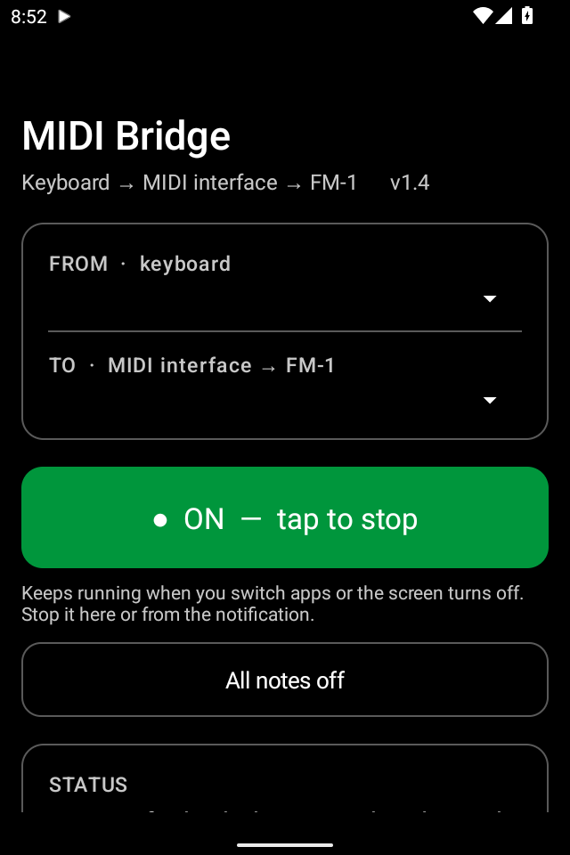
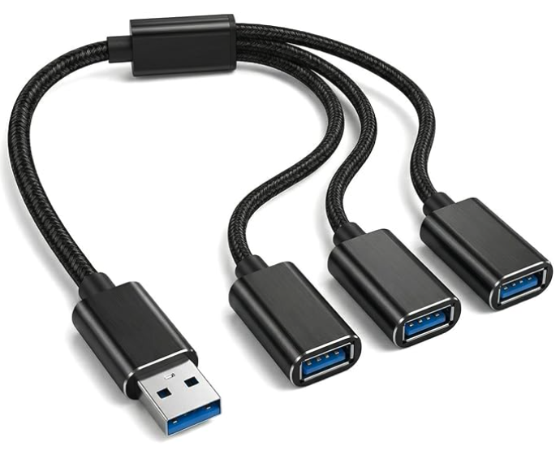

# Android USB MIDI Bridge

Play a synth from a **USB-only MIDI keyboard** when the keyboard has no 5-pin DIN MIDI OUT — using an Android tablet or phone as the go-between instead of a computer.

```
USB MIDI keyboard ──USB──┐
                         ├── USB hub ── Android tablet (this app)
USB MIDI interface ──USB─┘
        │
        └── DIN / TRS MIDI OUT ──> synth
```



*(Emulator screenshot, so the device pickers are empty — on a tablet they show the keyboard and interface, and the status card shows the note being played with its frequency.)*

Built for an M-Audio Keystation 49 MK3 (USB only) playing an M-VAVE FM-1 through an Arturia interface's MIDI OUT, but it works with any class-compliant USB MIDI devices Android can see.

### Bare-bones setup: synth on USB, no MIDI interface

If the synth has its own USB MIDI port (the FM-1 does), skip the interface and plug the synth into the tablet directly:

```
USB MIDI keyboard ──USB──┐
                         ├── USB hub (a 1-to-3 "Y" hub cable is enough) ── Android tablet
synth (e.g. FM-1)  ──USB─┘
```

**TO** picks the FM-1 automatically (it shows up as "USB Composite Device"). No MIDI cable goes to the FM-1 at all — the notes reach it over its USB cable.

## Hubs and charging

The tablet needs a **USB hub** between it and the two devices — but it can be tiny. A 1-to-3 USB "Y" hub cable works: it looks like a splitter cable but has a hub chip inside. This is the one used here (a USB 2.0, USB-A 1-in/3-out "Y extension hub cable", about $6):



 (A plain *power-only* Y splitter would not: two devices can't share one cable's data wires without a hub.) On a USB-C tablet, a USB-C-to-USB-A OTG adapter connects a USB-A hub cable like this one.

**Charging while playing depends on the tablet.** Some tablets charge and run USB devices at the same time through a hub with a PD charging input; others stop charging while they're powering USB devices, or won't do both at once at all. Try it with your tablet; if it won't charge, it still runs on battery, powering the keyboard and the FM-1 from the tablet.

## Download

Get the APK from [**Releases**](../../releases/latest), open it on the tablet, and allow installing from that source when Android asks. (It's a debug-signed sideload build, not a Play Store app, so Play Protect may warn — choose *Install anyway*.)

## Use

1. Plug the keyboard and the MIDI interface into a USB hub connected to the tablet. A hub with a **PD charging input** lets the tablet charge at the same time.
2. Open **MIDI Bridge**. **FROM** should show the keyboard, **TO** the interface — both are picked automatically by name and can be changed; pick the keyboard's main port, not a "Transport"/"DAW" port.
3. Tap the big button so it reads **ON**. The first time, allow notifications and allow the app to run in the background without battery limits.
4. Play. The screen shows the note and its frequency (e.g. `C4   261.6 Hz`) and every message forwarded.

It keeps running when you switch to another app or the screen turns off — a "MIDI Bridge is on" notification shows while it's running, with a **Stop** button. It remembers your devices and reconnects by itself when they're plugged back in. **All notes off** clears stuck notes.

## What it forwards

Everything from the keyboard's chosen port — notes, sustain, pitch bend, mod wheel, program changes, SysEx — unchanged (same MIDI channel). Only real-time bytes (clock, active sensing) are dropped.

## Build

Plain Java, no AndroidX or other dependencies. Needs JDK 17+ and the Android SDK (platform 34):

```
./gradlew assembleDebug
# -> app/build/outputs/apk/debug/app-debug.apk
```

## Code

- `Bridge.java` — device lists, connecting, and the forwarding itself (`android.media.midi`)
- `BridgeService.java` — foreground service + wake lock that keep it running in the background
- `MainActivity.java` — the screen, a remote control for the bridge

## Status

v1.4 is confirmed working on an Android 16 tablet, including in the background (another app in front).

## License

MIT — see [LICENSE](LICENSE).
